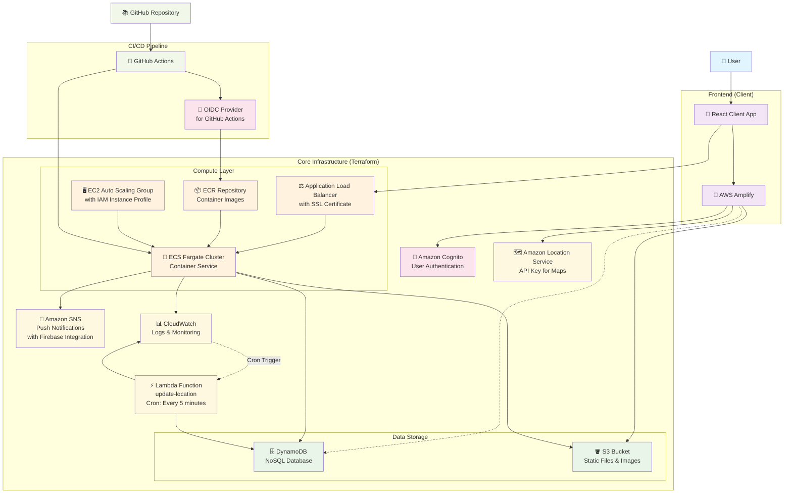

# postcard

## プロジェクト概要

本プロジェクトは、Project LINKS が提供する「モーダルシフト関連データ 自動車輸送統計調査」（[データセットはこちら](https://www.geospatial.jp/ckan/dataset/links-modalshift-2024)）を活用し、
日本全国を舞台に"絵葉書"が移動する様子を楽しめる SNS サービスです。
ユーザーは、移動アルゴリズムによって絵葉書がどのように旅をするかを可視化し、他のユーザーと共有できます。

- Progate ハッカソン powered by AWS で作成
- バックエンド: FastAPI
- フロントエンド: Next.js（PWA 対応）

## Tech Stack

### Backend


### Frontend


### Infrastructure




## セットアップ手順

### 前提条件

- Node.js（v18 以上推奨）
- Python（3.10 以上推奨）
- `git` コマンド

### クローン

```sh
git clone https://github.com/Riochin/postcard.git
cd postcard
```

### Pre-commit フックの設定

```sh
pre-commit install
```

### フロントエンド（Next.js）

```sh
# https://bun.com/docs/installation

cd client
bun install
# 開発サーバー起動
bun dev
```

### バックエンド（FastAPI + uv）

```sh
cd server
# uvのインストール（未導入の場合のみ）
curl -LsSf https://astral.sh/uv/install.sh | sh
# ~/.local/bin をPATHに追加（zshの場合）
export PATH="$HOME/.local/bin:$PATH"

# 依存パッケージのインストール
uv sync

# サーバー起動
uv run uvicorn main:app --reload
```

## ブランチ命名規則

以下の命名規則に従ってブランチを作成してください。

- 機能追加: `feature/<内容>`
- バグ修正: `fix/<内容>`
- ドキュメント: `docs/<内容>`
- リファクタリング: `refactor/<内容>`
- その他: `chore/<内容>`

例:

- `feature/login-page`
- `fix/typo-in-header`
- `docs/update-readme`
- `refactor/user-service`
- `chore/update-dependencies`

## コミットメッセージ命名規則

コミットメッセージは、以下のフォーマットに従って記載してください。

```
<type>: <簡単な説明>

<詳細（任意、必要に応じて）>
```

### type 一覧

- feat: 新機能の追加
- fix: バグ修正
- docs: ドキュメントのみの変更
- style: フォーマット（スペースやセミコロンなど）、コードの意味に影響しない変更
- refactor: リファクタリング（機能追加・バグ修正を含まない変更）
- test: テストコードの追加・修正
- chore: ビルドタスクや依存関係などの変更

### 例

- feat: ログイン画面を作成
- fix: ユーザー登録時のバリデーション不具合を修正
- docs: README にセットアップ手順を追記
