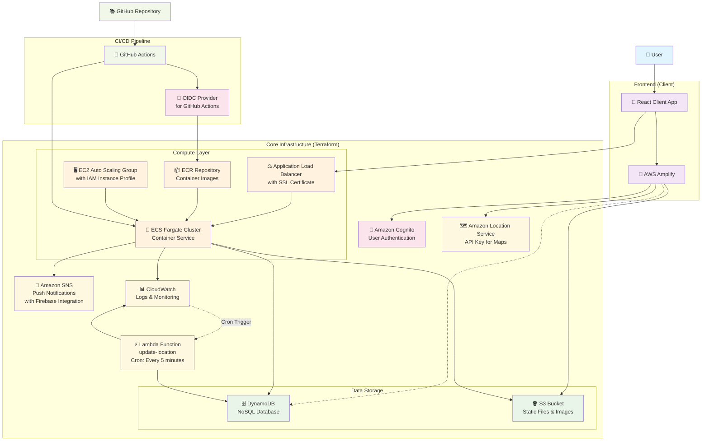

# AWS Architecture Diagram

## Architecture Overview

このプロジェクトは以下の主要コンポーネントで構成されています：

### Frontend Layer

- **React Client**: メインのフロントエンドアプリケーション
- **AWS Amplify**: 認証、データ、ストレージ、位置情報サービスの統合

### Core Infrastructure (Terraform)

- **ECS Fargate**: コンテナ化されたアプリケーションの実行
- **Application Load Balancer**: SSL終端とトラフィック分散
- **EC2 Auto Scaling**: 自動スケーリング機能付きインスタンス管理
- **DynamoDB**: NoSQLデータベース
- **S3**: 静的ファイルと画像の保存
- **Lambda**: 定期実行関数（5分間隔で位置情報更新）

### Additional Services

- **Amazon Cognito**: ユーザー認証とアクセス管理
- **Amazon SNS**: Firebaseと連携したプッシュ通知
- **Amazon Location Service**: 地図APIキーの管理
- **CloudWatch**: ログとモニタリング

### CI/CD Pipeline

- **GitHub Actions**: 自動デプロイメント
- **OIDC Provider**: セキュアなAWSアクセス
- **ECR**: Dockerイメージのレジストリ
